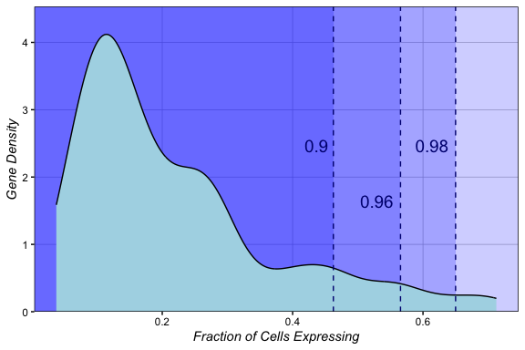
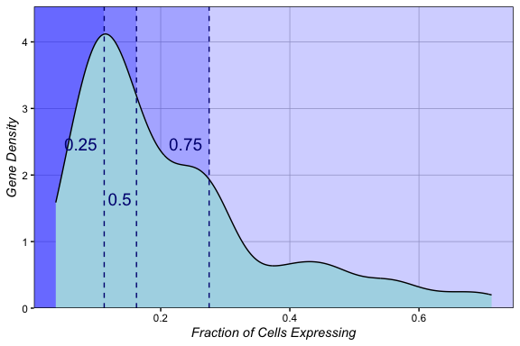
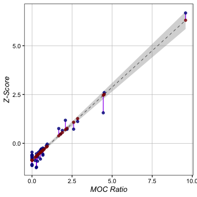
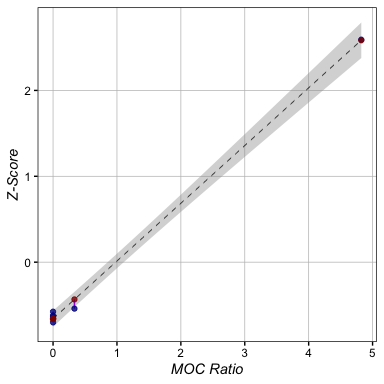
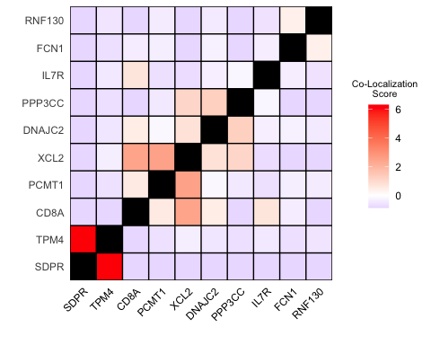
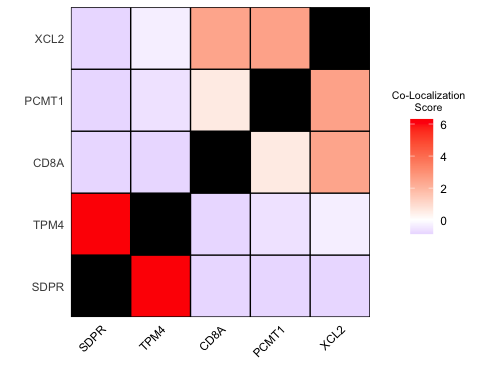

scCoExpress
================
Kathryn Lande
2025-05-06

## Single Cell Co-Expression

These functions identify the co-expression intensity of pairs of genes
within individual cells or nuclei, using single cell or spatial data
pre-processed in a Seurat Object.

These functions use a modified version of Mander’s Overlap Coefficient
between any pair of genes, wherein an average background MOC is
calculated using genes with a similar abundance to the target gene pair.
All results are reported as a comparison of the target MOC to the local
background MOC to account for the sparity of single cell data.

#### The Single-Cell MOC Calculation

- c = The cells in the experiment
- A = The vector of expression of gene A in all cells k
- B = The vector of expression of gene B in all cells k

$$ \left( \sum_{k=1}^c A_k B_k \right) / \sqrt{ \left( \sum_{k=1}^c A_k^2 \right)  * \left( \sum_{k=1}^c B_k^2 \right) } $$

**All modes of scCoExpress** return a ratio of the MOC of the genes of
interest against an average or distribution of MOCs from pairs of genes
with similar expression to the target genes. **Partition mode** splits
background genes into groups based on expression similarity. For any
pair of two target genes, the background MOCs are generated from the
partitions with the most similar expression to the targets. When
querying a large number of genes, this will be fastest. **Local mode**
generates backgrounds using the genes that have the most similar
expression to the two target genes. This mode is expected to be the most
accurate, but for a large number of genes, this mode takes a *very* long
time. However, if comparing a number of genes *smaller* than the number
of partitions in partition mode, local mode will actually be faster.

*Note that this is a permutation based method, and results are not
expected to be identical between different iterations of the same
comparison.*

#### Let’s load in Seurat’s example PBMC dataset. This data has already been filtered, but we’re going to apply an SCTransform, as we will need to use normalized data to quantify co-expression.

``` r
# Install scCoExpress (once):
# remotes::install_github("katlande/scCoExpress")

library(Seurat)
library(scCoExpress)
# SCTransform:
pbmc <- PercentageFeatureSet(pbmc_small, pattern = "^MT-", col.name = "percent.mt")
pbmc <- SCTransform(pbmc, vars.to.regress = "percent.mt", verbose = FALSE)

# Set 'SCT' to the default assay
DefaultAssay(pbmc) <- "SCT"
```

#### Co-Expression will run on all the cells in the input Seurat object; to make the results sample, celltype, or condition-specific, you’d need to subset your data prior to quantifying Co-Expression. For the sake of this tutorial, we will look at all the PBMC cells together.

## Setting up Co-Expression

Prior to co-expression, we need to identify a threshold for highly
expressed genes. If we are running co-expression in ‘partition’ mode, we
want to remove any very highly expressed genes from the background set,
as they can cause inaccuracies in the score calculation.

``` r
pbmc_expr <- getGeneExpr(pbmc, "SCT", "data", 5)
CheckMaxQuantile(pbmc_expr)
```



#### Here we see about 90% of genes are expressed in less than ~50% cells, and the bottom 98% of genes are expressed in fewer than ~65% of cells. We can also look at other quantiles:

``` r
CheckMaxQuantile(pbmc_expr, quantiles = c(0.25, 0.5, 0.75))
```



#### Here we can see that the top 25% of genes have a much wider range of abundance. Parition accuracy relies strongly on the abundance of genes in the partitions being relatively similar, so these very high abundance outliers need to be pruned out. We’ll set our top quantile to 0.96 for this comparison.

## Running Co-Expression

``` r
# select 10 random genes to query for co-expression:
genes <- c("PCMT1", "XCL2", "RNF130", "SDPR", "FCN1", "CD8A", "DNAJC2", "PPP3CC", "TPM4", "IL7R")

coExpr_Res <- 
  CoExpress(obj = pbmc, 
            target_genes = genes, 
            topExcl = 0.96, 
            bottomExcl = 0.005, # removes any genes in fewer than 0.5% of cells   
            nPermutations = 20, # number of permutations to use for per partition pair (more permutations = more accurate, but more time-expensive). For larger sets, 50 permutations are recommended. We will use 20 here as the pbmc small set contains only 220 genes.
            nPartitions = 4, # number of groupings to use for background (more partitions = more accurate, but more time-expensive). For larger sets, 10 partitions are recommended. We will use 4 here as the pbmc small set contains only 220 genes (~50 genes/partition).
            BkgdGeneExpr=pbmc_expr, # if NULL, pbmc_expr will be generated internally
            skip.extremes = T) # comparisons containing very highly and very lowly expressed genes will be ignored; if F, these genes will use the most similarly expressed genes as the background instead; this may cause large increases in computing time.
```

    ## ..........
    ## .............................................

#### Here’s a summary of what all the options in the CoExpress() function actually do:

- **obj**: Seurat Object
- **target_genes**: Vector of gene names
- **gene2**: Target gene if only comparing one, or NULL if all pairwise
  comparisons
- **seuratAssay**: Seurat Assay to use (defaults to defaultAssay)
- **seuratSlot**: Seurat assay slot to use (defaults to “data”)
- **nPartitions**: gene partitions, set to NULL for local backgrounds
  (only for small gene lists)
- **nPermutations**: number of permutations for parition backgrounds, or
  for local backgrounds if nParitions is NULL
- **BkgdGeneExpr**: getGeneExpr() output object, runs internally if NULL
- **topExcl**: value between 0-1, percentile above which cells will be
  set as “extreme” genes
- **bottomExcl**: value between 0-1, minimum fraction of cells a gene
  needs to be expressed in, below which genes will be set as “extreme”
- **local.perms**: in partition mode, the number of permutations to run
  on high and low expressed genes locally
- **skip.extremes**: skips tabulating co-expression on comparisons with
  very highly or very lowly expressed genes
- **seurat**: main Seurat version being used (e.g, 3, 4, 5…), as
  numeric.

## QCing Co-Expression

If co-expression is reliable, we should expect very small residuals
between the co-expression ratio and the co-expression Z-score:

``` r
ShowResiduals(coExpr_Res)
```



In most cases, reducing the number of partitions and permutations will
increase the residuals dramatically. This may not always be true if the
number of genes in your Seurat Object is very small (such as with
Seurat’s PBMC small example data).

## Local Backgrounds

For smaller gene sets, it may be faster to simply run comparisons
locally. Rather than generating paritions, the background MOC values are
calculated using the genes with the most similar expression to the genes
in each pair.

``` r
coExpr_Res_Local <- 
  CoExpress(obj = pbmc, 
            target_genes = genes[1:4], 
            topExcl = 0.96, 
            bottomExcl = 0.005, 
            nPermutations = 50, 
            nPartitions = NULL, # set partitions to NULL to run local mode 
            BkgdGeneExpr=pbmc_expr,
            skip.extremes = T)
```

    ## Warning in CoExpress(obj = pbmc, target_genes = genes[1:4], topExcl = 0.96, : A
    ## low number of comparisons may cause inaccurate Z-score adjustment.

``` r
ShowResiduals(coExpr_Res_Local)
```



#### We also expect local mode to have very small residuals.

## Understanding the Co-Expression output values

- GeneA & GeneB: the genes in your comparison.
- MOC: The Mander’s Overlap Coefficient of Genes A&B
- MOC_bkgd: the mean Mander’s Overlap Coefficient of the background
  genes.
- MOC_Z: the Z-score of the target MOC against all background MOC
  values. Positive values mean mean co-expression occurs more than
  expected by chance; negative values mean co-expression occurs less
  than expected by random chance. Z-scores with a greater magnitude
  imply a stronger co-expression relationship.
- Comparison_Type: in partition mode, this tells you which parition both
  genes come from. E.g., g1-g6 means you are comparing a gene from
  parition 1 (low abundance) to a gene from parition 6 (highest
  abundance when nParitions=6).
- MOC_ratio: MOC/MOC_bkgd. Values \>1 mean co-expression occurs more
  than expected by chance; values \<1 mean co-expression occurs less
  than expected by random chance.
- Zadj: if the MOC_Ratio and the Z-score are tightly associated, the
  Z-score will be adjusted to the regression line of MOC_Z~MOC_ratio.
  Z-scores are generally more variable than the ratio values, and this
  corrects for the variation.

``` r
head(coExpr_Res)
```

    ##   GeneA  GeneB        MOC   MOC_bkgd       MOC_Z Comparison_Type MOC_Ratio
    ## 1 PCMT1   XCL2 0.56933620 0.12632839  2.59892064           g3-g1 4.5067953
    ## 2 PCMT1 RNF130 0.05273648 0.08580828 -0.29987038           g3-g2 0.6145849
    ## 3 PCMT1   SDPR 0.00000000 0.08580828 -0.77804528           g3-g2 0.0000000
    ## 4 PCMT1   FCN1 0.18334048 0.27136465 -0.55078577           g3-g4 0.6756240
    ## 5 PCMT1   CD8A 0.23897420 0.12632839  0.66084051           g3-g1 1.8916903
    ## 6 PCMT1 DNAJC2 0.08161146 0.08580828 -0.03805365           g3-g2 0.9510907
    ##         Zadj
    ## 1  2.5077046
    ## 2 -0.4029616
    ## 3 -0.8625595
    ## 4 -0.3573154
    ## 5  0.5520812
    ## 6 -0.1513164

## Visualizing Co-Expression

We can look at co-expression relationships with plotCoExpr()

``` r
plotCoExpr(coExpr_Res)
```



Or with the top relationships only:

``` r
# select all genes with an absolute adjusted Z-score above 2:
unique(c(coExpr_Res$GeneA[abs(coExpr_Res$Zadj) > 2],
  coExpr_Res$GeneB[abs(coExpr_Res$Zadj) > 2])) -> topGenes

# subset coexpression data to only include comparisons of the top genes:
coExpr_top <- subset(coExpr_Res, GeneA %in% topGenes & GeneB %in% topGenes)

plotCoExpr(coExpr_top)
```



Here we see our best co-expression groups!
